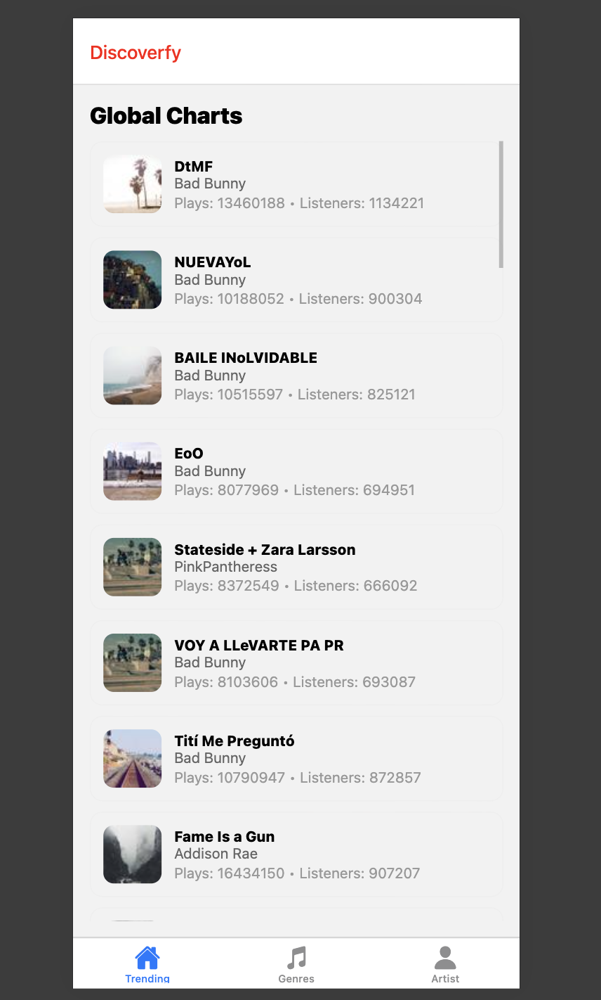

# Music Discovery Platform (Mobile + Backend)

## Overview

This project is a **Full Stack Music Discovery Platform App** consisting of:

* **Mobile Frontend** (React Native / Expo)
* **Backend API** (Node.js + Express)
* **External Music Data** (Last.fm API + Public APIs)

The goal is to support **music trend discovery**, allowing users to explore:

* Top tracks by artist
* Music by genre (tags)
* Trending/global charts

The architecture is modular and designed to scale to additional providers (Spotify, Apple Music) in the future.

---

## Tech Stack

* **React Native**
* **Expo**
* **Expo Router (Tabs)** 
* **TypeScript**
* **Axios / Fetch for API calls**
* **React Native Gesture Handler**
* **Node.js/Express.js for Backend Server**

---

## High-Level Architecture
The following is a high-level architecture of how the native application interacts with the backend and how the backend server interacts with external APIs.

```
[ Mobile App (Expo) ]
          ▲
          │ HTTPS (REST) 
          ▼
[ Backend API (Express) ]
  ▲               │
  | Response      │ Axios
  |               ▼
[ Last.fm API + Public APIs]
```

---

## Project Structure

Backend: Contains codebase for the backend server that the frontend/native application interact with. The tech stack for the backend consists of Node.js + Express.js and the external APIs that we
used are Last.fm API for music metadata + information and a public API Picsum API to retrieve random images for the song covers. 

Note: Last.fm's API image response returns empty image pngs and we were unable to rely on Last.fm for retrieving the real picture covers of a given song or album. Instead we used a public API and randomly generated photos as current placeholders for the image attribute of our songs.

Mobile (Frontend): Contains codebase for the expo mobile application. The tech stack consists of using React Native, Expo Router for tab navigation, Typescript to leverage types and consistency with backend response types, and CSS to prettify the application.

---

## How to Use Application!

### Clone Repo Locally
You can clone the repo via HTTPS:
- HTTPS: `git clone https://github.com/brandonsotouci/CS125_Project.git`

### Environment Variables
The following environment variables need to be configured in  `backend/.env` in order to use the backend:

- LASTFM_API_KEY: The API Key used to retrieve last fm responses. You can retrieve your own token by making an account and registering for a key.
- PORT: THe port that the backend will use. Our default port is 3000.

Example of `backend/.env` file:
```
LASTFM_API_KEY=your_lastfm_api_key
PORT=3000
```
---

The following environment variable also need to be configured in `mobile/.env` for the frontend to interact with the backend. 
- EXPO_PUBLIC_COMPUTER_IP: Your computer's IP address so the frontend can interact with the server locally 
- EXPO_PUBLIC_BACKEND_PORT: The port that the backend server uses. This would be 3000 if your PORT variable in `backend/.env` is 3000.


Example of `mobile/.env` file:
```
EXPO_PUBLIC_COMPUTER_IP=your_computer_ip
PORT=same_port_as_backend_port
```
---

We plan to migrate our backend to a cloud service to provide reliability and avoid IP usage.

### Start Backend Server
To start the backend server, `cd` onto the backend folder
```cd backend``

Install all required node packages
```npm install```

To start the server, run the following command. The `server.js` contains the code to start the server and listen at a given port.

```node server.js``
You should see a message that says listening on [port]. That 

### Starting Expo Application
To start the expo app, `cd` onto the mobile folder from the root directory of the project.
```cd mobile```

Install all required node packages
```npm install```

To start the server, run the following command.
```npm start```

This triggerse the `start` script in `package.json` which triggers `expo start`. You should see a "Web is waiting on..." message witht the localhost URL. You should be able to access the app from there!

In terms of IOS interaction, a backend server with HTTPS is required and we are working to enable HTTPS/host our backend via cloud as Expo IOS does not permit requests to HTTP.

Note that the backend server and frontend server must be running at the same time!


## Preview



## Next Steps
- Integrate search of songs and possibly add filter recommendations on the same page if it does not clutter the user interface
- Integrate recommendation system so the user can get recommended tracks
- Create Single Page + Component for Individual Tracks + Albums

